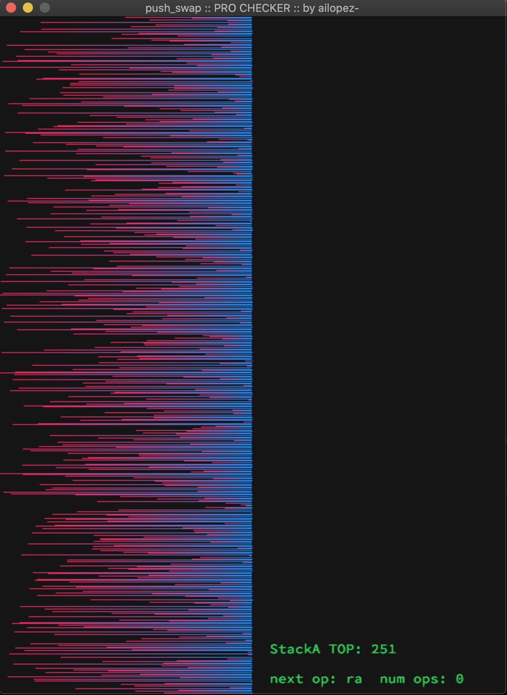

<div align="center">
	
	<h3>push_swap</h3>
</div>

# Push_Swap

## Project Overview

`Push_Swap` is a coding project from the 42 school curriculum, designed to introduce students to complex algorithms, particularly focusing on sorting algorithms and stack operations. The objective is to sort data on a stack with a limited set of operations, using the smallest number of actions. The project is divided into two programs:

- **`push_swap`**: This program calculates and displays a list of operations that sort a stack of integers.
- **`checker`**: This is a supplementary program that checks if the list of operations from the `push_swap` program actually sorts the stack.

## Features

- **Efficient Sorting Algorithm**: Implements an advanced sorting algorithm to sort numbers in ascending order with minimal stack operations.
- **Error Handling**: Robust validation of input data to handle errors gracefully.
- **Visualization Tool**: Includes a visualizer to watch the sorting algorithm in action, enhancing understanding and debugging.

## Getting Started

### Prerequisites

- GCC compiler
- Make
- Ruby (optional, for generating random numbers)

### Installation

Clone the repository and compile the programs using the Makefile:

```bash
git clone https://yourrepositorylink.com/push_swap.git
cd push_swap
make
```

### Usage
Running push_swap
To run push_swap, you need to provide a series of space-separated integers:

```bash
./push_swap 42 21 17 6 8
```

This will output a series of operations that sort the numbers.

### Verifying with checker
To verify that the operations output by push_swap are correct, you can pipe its output to checker:

```bash
ARG="42 21 17 6 8"; ./push_swap $ARG | ./checker $ARG
```

### Bonus Feature
The bonus part includes the checker program, which can be compiled using:

```bash
make bonus
```

## Visualizer
The [visualizer](https://github.com/ailopez-o/42Barcelona-PushSwap-ProChecker) can help you see the sorting process. To use it, download and build the visualizer with the following command:
```bash
make v
```
Then, run the visualizer (only works in bash):

```bash
ARG=$(ruby -e "puts (0..500).to_a.shuffle.join(' ')"); ./push_swap ${ARG} | ./pro_checker ${ARG}
```



## Additional notes

Visualizer used is: https://github.com/ailopez-o/42Barcelona-PushSwap-ProChecker
